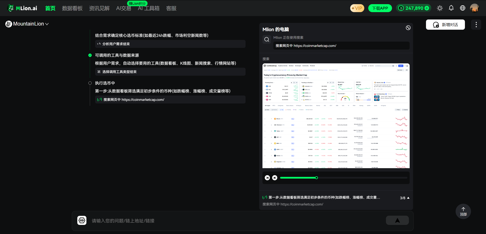
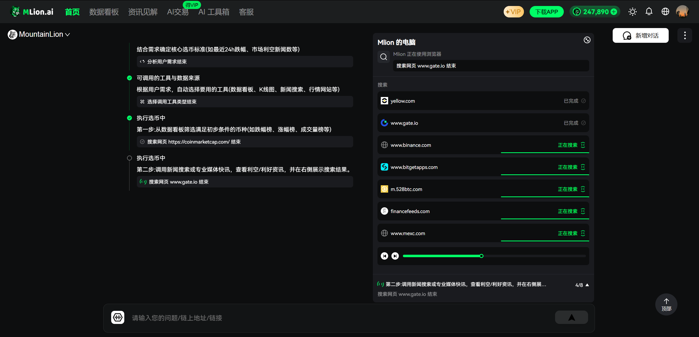
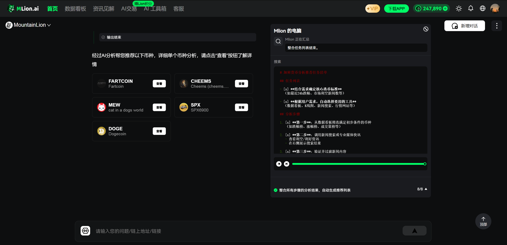
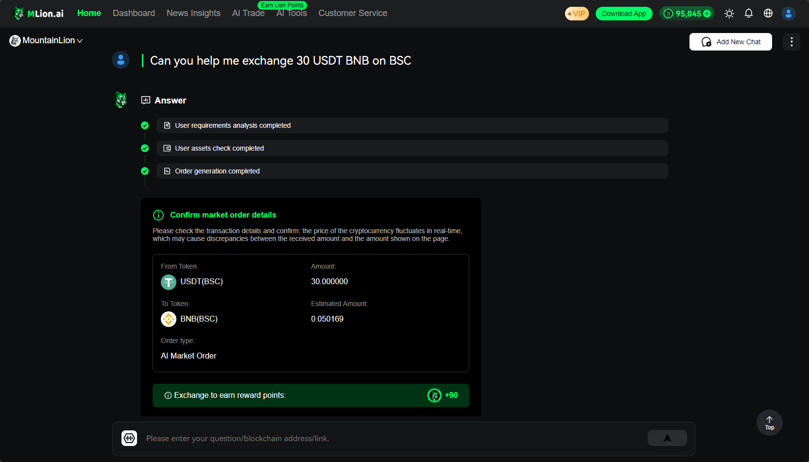

# GenAI Platform: 基于 RAG 架构的智能聊天机器人后端解决方案

<div align="center">
  
</div>

<div align="center">
  <p>
    <a href="https://github.com/MountainLionAi/GenAI-Platform">
        
    </a>
    <a href="https://github.com/MountainLionAi/GenAI-Platform">
        
    </a>
    <a href="https://opensource.org/licenses/Apache-2.0">
      
    </a>
    <a href="https://github.com/MountainLionAi/GenAI-Platform/releases">
      
    </a>
    <a href="https://github.com/MountainLionAi/GenAI-Platform/issues">
      
    </a>
  </p>
  <p>
    <a href="https://codespaces.new/MountainLionAi/GenAI-Platform">
      
    </a>
  </p>
  <p>
    <a href="https://www.mlion.ai/#/">mlion.ai</a> 基于此平台技术构建
  </p>

[**English**](README.md)
</div>

## Mlion.ai最新更新：AI推荐虚拟币，以及AI一键买币功能增强

Mlion.ai最近在AI交易板块的"AI一键买币"功能中推出了重大更新，进一步提升了用户体验和交易便捷性。这次更新提供了以下新特性：

- **AI自动化交易支持多种订单类型**：支持通过自然语言下达市价单、限价单、跨链限价单等交易指令
- **多场景交易支持**：提供钱包操作、多轮对话、余额不足提示、不在兑换范围、不支持兑换币种等多种场景处理
- **自然语言交易示例**：用户可以直接使用自然语言如"买15U的BNB"、"当BNB涨到800U时卖出0.03个BNB"等方式进行交易
- **丰富的币种支持**：支持BTC、ETH（ERC20、BSC、Polygon）、BNB（BSC）、POL（Polygon）、USDT（ERC20、BSC、Polygon）等多种币种
- **Agent工作流程可视化**：推荐币的整个流程会清晰地展示给用户，让用户更直观地了解Agent选币的底层逻辑

📌 **AI 选币交易产品展示图:**






📌 **AI SWAP产品展示图:**


更多详情和演示视频，请访问：[https://x.com/MLion_AI](https://x.com/MLion_AI)

## 目录
- [GenAI-Platform 简介](#genai-platform-简介)
- [核心特性](#核心特性)
- [为什么选择 RAG?](#为什么选择-rag)
- [GenAI-Platform RAG](#genai-platform-rag)
- [Multi Agent](#multi-agent)
- [项目中的子系统](#项目中的子系统)
- [项目安装和运行](#项目安装和运行)
- [API接口介绍](#api接口介绍)
- [项目目录结构](#项目目录结构)
- [技术栈介绍](#技术栈介绍)
- [项目应用场景](#项目应用场景)
- [基于GenAI Platform开发的应用](#基于genai-platform开发的应用)
- [许可证信息](#许可证信息)
- [开发者优势](#开发者优势)
- [联系方式与社区](#联系方式与社区)

### GenAI-Platform 简介

`GenAI Platform` 是一个开源项目，旨在提供基于 Retrieval-Augmented Generation (RAG) 架构的全面后端解决方案，使开发人员能够为特定垂直领域构建和部署智能聊天机器人。该平台整合了最新的大型语言模型技术，使开发人员能够无缝合并各种信息源。通过精心设计的调度系统、高效的查询转换和路由机制，为用户提供准确和相关的响应。此外，`GenAI Platform` 支持使用微软开源的 AutoGen 框架进行多代理协作，增强了系统处理复杂查询和任务的能力。

## 核心特性

- **多信息源整合**: `GenAI Platform` 支持基于云的互联网搜索、数据库存储和向量存储，使聊天机器人能够访问和处理来自多个信息源的数据。

- **智能调度器**: 平台创新开发的调度器使用嵌入模型处理用户查询，利用功能过滤和匹配来识别有效的信息源，并选择最合适的功能来构建生成答案的最终提示。

- **高效的查询处理**: 通过查询转换和路由，`GenAI Platform` 能够将用户查询转换为一系列查询，然后选择最合适的工具提供答案。

- **灵活的代理选择**: 平台内置的代理选择机制支持各种查询处理代理，如 LlamaIndex 和 Langchain，为用户查询提供更多的处理选项。AutoGen 框架的集成进一步促进了多个代理之间的合作，确保了全面和准确的响应。

- **多模型集成与切换支持**: `GenAI Platform` 允许连接多个大型语言模型 (LLMs) 并提供轻松切换，增强了系统的灵活性和适应性。

- **一站式后端服务**: `GenAI Platform` 提供全面的后端支持，包括用户管理、支付系统、消息管理和系统日志管理。

- **良好的可扩展性**: 基于模块化设计，开发人员可以轻松添加新功能和模块。

- **支持 Web 异步响应**: 使用 sanic Web 框架，支持异步请求处理，确保快速响应。

`GenAI-Platform` 是一个基于 RAG (Retrieval Augmented Generation) 框架的应用。RAG 支持通过从 LLMs 之外的源检索数据来生成答案。RAG = 搜索 + LLM 提示，其中 LLM 使用搜索算法根据用户查询从外部数据源获取上下文信息。最后，将查询和检索到的上下文结合并输入到 LLM 提示中，提供高度准确和上下文相关的响应。

<div align="right">
    <a href="#目录">↑ 返回目录 ↑</a>
</div>

## 为什么选择 RAG?

### LLM的知识更新难题

- LLM 的训练数据集是固定的，因此一旦训练完成，很难再通过继续训练来更新其知识。
- LLM 参数量庞大，任何时候进行 fine-tuning 都需要消耗大量的资源且耗时。
- 无法直接查询或编辑 LLM 中编码的数百亿参数中的知识。
  
因此,为了让 LLM 拥有持续学习和获取新知识的能力, RAG 应运而生。

### RAG 的工作原理

1. **知识索引**: 对文本数据进行处理,通过词嵌入等技术进行向量化，并存入数据库中，形成可检索的向量索引。
2. **知识检索**: 当有一个输入问题时, RAG 会检索知识库以找到与问题最相关的文档。
3. **生成答案**: RAG 会提供问题和检索到的文档给 LLM，允许 LLM 融合这些外部知识，并生成答案。

这使得 LLM 能够利用外部知识库，无需修改其参数。当知识库更新时，新知识也可以实时注入到 LLM 中。

<div align="right">
    <a href="#目录">↑ 返回目录 ↑</a>
</div>

## GenAI-Platform RAG

<div align="center">
  
</div>

在 `GenAI Platform RAG` 系统中，整个查询处理流程是通过一系列精心设计的组件完成的。以下是系统的概述：

用户的查询和聊天历史首先进入 Embedding Model 模块，该模块处理并编码输入。处理后的数据然后进入 Dispatcher 模块。Dispatcher 使用 Function Filter 选择适当的 GPT Function，通过调用 OpenAI API 执行。

在 Dispatcher 中，选择功能后，根据 Match Prompt 生成最终提示，然后发送到 Agent 模块。Agent 模块使用工具（如 Llamaindex 和 Langchain）执行查询转换和查询路由，将查询转换为合适的信息请求，并确定查询的最佳路径。

信息源模块包括互联网搜索（如 Bing、Metaphor、Perplexity）、DB Storage 和 Vector Storage。Agents 从这些源中检索数据，并通过 Fusion Retrieval 将相关信息返回给调度模块。

最后，调度模块将处理后的数据和生成的提示发送给 LLM 进行生成，生成的答案返回给用户，完成整个查询处理过程。此过程通过有效利用多种信息源和先进的查询处理技术，确保用户获得准确和详细的答案。


在 `GenAI Platform RAG` 系统中，整个查询处理流程是通过一系列精心设计的组件完成的。以下是主要部分及其功能：

### Dispatcher

- **Embedding Model**: 利用嵌入模型处理查询，将查询和聊天历史转换为向量形式，以便后续的检索和匹配。

- **Function Filter**: 该组件使用向量数据库过滤可能的 GPT 功能，有效地解决了 GPT 功能数量的潜在限制。

- **Function Choice**: 在此阶段，系统利用 GPT 的功能调用能力，允许与语言模型进行交互，以确定用户查询的上下文和意图。GPT 功能主要将用户输入分类为场景。例如，名为 "Currency News" 的功能可能被定义为处理“关于特定事物的新闻、媒体信息、关于特定事物的最新更新”。一旦 GPT 功能确定了场景，它会指定回答问题所需的参考资料来源，如数据库、API、搜索引擎等。如果用户的问题不能很好地回答，系统会总结问题的场景并添加新功能来解决它。

- **Vector Databases**: Dispatcher 可以指定多个适用于不同领域的向量数据库，确保系统能够为各种问题检索和匹配最相关的信息。

- **Final Prompt Generation**: 选择功能后，Dispatcher 根据 Match Prompt 生成最终提示。然后将此提示发送到 Agent 模块以进行进一步处理。

通过整合这些组件，Dispatcher 确保系统准确地分类查询，选择适当的功能和信息源，并为 Agent 模块有效处理查询做好准备。


### 信息源

- **Web 搜索工具**: 利用云技术，系统可以执行互联网搜索以获取广泛的实时信息，为生成的答案提供丰富的数据支持。在此过程中可能使用的工具包括 Bing、Metaphor、Google 等。

- **DB 存储**: 存储结构化数据，为查询提供必要的历史信息和事实数据。

- **向量存储**: 存储特征向量，用于快速检索和比较信息，加速查询处理过程。

### Agent

- **Agent 选择**: 在确定要执行的功能后，进入代理选择步骤。此步骤专门设计用于需要更深理解和分析的复杂问题。LlamaIndex 中的代理与语言模型交互，以选择正确的工具处理问题。此代理的功能是与系统内的不同信息源进行多次交互，汇总和合成信息，以生成更精确和深入的答案。通过代理选择和工具之间的多次交互，系统可以深入分析问题，结合多个数据点并考虑不同的信息源以优化答案。这确保了即使面对复杂的查询，`GenAI Platform` 也能提供既深刻又高质量的答案，不仅反映数据的准确性，还能深入理解用户查询背后的意图。

- **查询转换**: 将原始查询转换为适合处理的形式，这可能包括重构或扩展查询。

- **查询路由**: 确定转换后的查询应发送到哪个信息源或工具进行处理。

- **融合检索**: 结合来自多个信息源的数据进行查询处理，增强答案的准确性和相关性。

### 搜索引擎集成

<div align="center">
  
</div>

- **查询评估**: 当用户提交查询时，系统会评估该查询是否需要结合检索增强生成 (RAG) 和外部搜索功能的综合方法。

- **异步任务执行**: 如果需要综合方法，则将查询路由到执行 RAG 过程和搜索引擎查询的异步任务模块。

- **搜索引擎利用**: 系统利用搜索引擎（如 Serper、Exa 或 Google）获取相关来源、搜索结果和相关查询。

- **信息整合**: 获取的信息反馈到系统中，并进行提示工程处理。

- **最终响应生成**: 大型语言模型 (LLM) 使用整合的信息生成用户的最终响应。

- **直接查询处理**: 如果查询不需要结合 RAG 和搜索引擎方法，则直接将其发送到提示工程模块，然后由 LLM 生成响应。

此过程使系统能够根据查询需求灵活选择适当的处理流程，确保提供准确和全面的响应。通过将 RAG 方法与外部搜索功能相结合，系统可以为用户提供更全面和精确的信息。

### 最终答案生成

- **匹配提示**: 根据功能选择和信息检索的结果匹配适当的提示模板。

- **最终提示**: 将匹配的提示与检索到的信息结合起来，生成供语言模型使用的最终提示。

- **大型语言模型 (LLM)**: 使用最终提示通过大型语言模型生成用户查询的答案。

### 总结

`GenAI-Platform` 的完整检索增强过程确保了答案的生成不仅基于直接查询的数据，还基于智能选择的功能处理和代理工具的输入，从而提供高质量、个性化和准确的答案。

<div align="right">
    <a href="#目录">↑ 返回目录 ↑</a>
</div>

## Multi Agent

我们引入了微软的开源项目 AutoGen 作为我们的Multi Agent系统框架，使多个 AI 代理能够协作完成复杂任务。以下是 AutoGen 及其在我们系统中的集成概述：

AutoGen 是一个开源编程框架，用于构建 AI 代理并促进多个代理之间的合作以解决任务。AutoGen 旨在简化代理 AI 的开发和研究，就像 PyTorch 对深度学习所做的那样。它提供了以下功能：

- **代理协作**: AutoGen 使代理能够相互交互以协作解决任务。
- **多模型支持**: 促进各种大型语言模型 (LLMs) 和工具使用的支持。
- **灵活的工作流程**: 支持自主和人工参与的工作流程。
- **会话模式**: 支持用于复杂工作流程的多代理会话模式。
- **增强的 LLM 推理**: 提供 API 统一和缓存等实用程序，以及错误处理、多配置推理、上下文编程等高级使用模式。

<div align="center">
  
</div>

AutoGen 简化了复杂 LLM 工作流程的编排、自动化和优化，最大限度地提高了 LLM 模型的性能并克服了它们的弱点。它支持用于复杂工作流程的多种会话模式。通过可自定义和可对话的代理，开发人员可以使用 AutoGen 构建各种会话模式，涉及会话自主性、代理数量和代理会话拓扑结构。

我们的实现使用 AutoGen 来管理和协调多个代理，增强了系统处理复杂查询和任务的能力。通过利用不同 AI 代理的优势，这使我们能够提供更全面和精确的响应。

AutoGen 集成到我们系统中的示例代码展示在 `examples` 文件夹中的 `multi_agent_t001.py` 文件中。核心功能封装在 `genaipf` 文件夹下的 `agent` 目录中的 `autogen.py` 文件中。

<div align="right">
    <a href="#目录">↑ 返回目录 ↑</a>
</div>

## 项目中的子系统


1. **智能聊天机器人**: 基于 OpenAI 的 GPT 模型，该子系统是 `GenAI Platform` 的核心，提供用户智能互动聊天体验。通过 `GenAI Platform RAG` 系统，它可以处理大规模和复杂的查询，同时保持快速响应和高准确性。此外，系统现在支持与 Telegram 的集成，允许用户通过 Telegram 机器人与聊天机器人互动，促进项目引流并增强用户参与度。

2. **用户管理系统**: 该子系统处理与用户账户相关的所有功能。它支持基本的用户注册、登录和注销功能，并提供验证码和电子邮件验证等安全措施，确保用户可以安全访问其账户，并保护平台免受未经授权的访问。

3. **消息管理系统**: 允许用户高效有序地管理他们的通信。用户可以检索历史消息，分享重要信息，甚至删除不再需要的对话。此外，系统支持流式处理，确保消息与前端的及时互动。

4. **支付系统**: 集成了支付功能，允许用户查询支付卡信息、订单检查和账户查询。

5. **系统日志管理系统**: 该子系统负责记录和管理系统日志，对于监控系统运行、调试和安全审计至关重要。它跟踪用户活动、系统性能以及任何潜在的异常或安全事件，为系统管理员提供宝贵的信息。

6. **Telegram 机器人集成**: 这一新功能允许智能聊天机器人与 Telegram 集成，提供一个额外的用户互动平台。通过利用 Telegram 机器人，用户可以直接通过 Telegram 应用与聊天机器人互动，使用户更容易访问平台的服务，并扩大项目的覆盖范围。

<div align="right">
    <a href="#目录">↑ 返回目录 ↑</a>
</div>

## 项目安装和运行

1. **安装项目**：

```bash
cd GenAI-Platform
pip install -e .
```

2. **加载向量数据库内容**：

```bash
cd GenAI-Platform
python app.py -a
```

3. **运行平台**：

```bash
cd GenAI-Platform
python app.py
```

<div align="right">
    <a href="#目录">↑ 返回目录 ↑</a>
</div>

## API 接口介绍 (v1 API 版本控制)

| 类别          | API 路径                   | 方法   | 功能描述                              |
|---------------|----------------------------|--------|---------------------------------------|
| **GPT**       | `api/v1/sendChat`          | POST   | 发送聊天内容                          |
|               | `api/v1/getMessageList`    | GET    | 获取消息列表                          |
|               | `api/v1/getMsgGroupList`   | GET    | 获取消息组列表                        |
|               | `api/v1/delMsgGroupList`   | POST   | 删除消息组                            |
|               | `api/v1/sendStreamChat`    | POST   | 发送流式聊天内容                      |
|               | `api/v1/sendOneshotChat`   | POST   | 发送一次性聊天内容                    |
|               | `api/v1/sendRawChatStream` | POST   | 发送原始聊天流                        |
|               | `api/v1/sendStylizedRequest`| POST  | 发送样式化请求                        |
| **UserRate**  | `api/v1/userRate`          | POST   | 用户评分                              |
|               | `api/v1/delMessages`       | POST   | 根据代码删除消息                      |
|               | `api/v1/shareMessages`     | POST   | 分享消息                              |
|               | `api/v1/getShareMessages`  | POST   | 获取共享消息                          |
| **Assistant** | `api/v1/assistantChat`     | POST   | 与助手互动                            |
|               | `api/v1/getAssistantHistory`| POST  | 获取助手聊天历史                      |
| **User**      | `api/v1/userLogin`         | POST   | 用户登录                              |
|               | `api/v1/checkLogin`        | GET    | 检查登录状态                          |
|               | `api/v1/register`          | POST   | 用户注册                              |
|               | `api/v1/loginOut`          | GET    | 用户登出                              |
|               | `api/v1/sendVerifyCode`    | POST   | 发送验证码                            |
|               | `api/v1/sendEmailCode`     | POST   | 发送电子邮件验证码                    |
|               | `api/v1/getCaptcha`        | GET    | 获取验证码图片                        |
|               | `api/v1/testVerifyCode`    | POST   | 验证验证码                            |
|               | `api/v1/modifyPassword`    | POST   | 修改密码                              |
|               | `api/v1/newsbot`           | GET    | 获取新闻                              |
|               | `api/v1/userLoginOther`    | POST   | 使用其他方式登录                      |
|               | `api/v1/addFeedback`       | POST   | 添加用户反馈                          |
| **Pay**       | `api/v1/pay/cardInfo`      | GET    | 查询支付卡信息                        |
|               | `api/v1/pay/orderCheck`    | GET    | 检查订单                              |
|               | `api/v1/pay/account`       | GET    | 查询用户账户                          |
|               | `api/v1/pay/callback`      | POST   | 支付成功回调                          |

<div align="right">
    <a href="#目录">↑ 返回目录 ↑</a>
</div>

## 项目目录结构

以下是 `GenAI-Platform` 在 `genaipf` 中的主要目录结构及其功能描述：

- **agent**: 包含各种代理功能，包括与 AutoGen 和 LlamaIndex 的集成，提供多代理协作和任务处理的框架。

- **bot**: 包含将项目输入和输出连接到 Telegram 机器人的代码，促进通过 Telegram 与聊天机器人的互动。

- **conf**: 包含项目的各种配置文件，如服务器端口、数据库连接等。

- **constant**: 存储项目中使用的常量定义，如错误代码、消息常量等。

- **controller**: 负责处理 API 请求，与前端交互并返回响应。API 接口定义如 `sendchat_gpt4` 和 `userLogin` 就在这里定义。

- **dispatcher**: 处理 API 调度逻辑，将特定请求路由到相应的控制器或处理程序。

- **exception**: 该目录包含自定义异常处理逻辑和自定义异常类的定义。

- **interfaces**: 定义与外部系统或其他项目模块交互的接口。

- **middlewares**: 用于处理 API 请求和响应的中间件。这些中间件可以执行身份验证、日志记录等任务，以进行预处理和后处理。

- **routers**: 定义所有 API 路由，确保每个请求都正确定向到适当的控制器。

- **services**: 包含项目的核心业务逻辑和数据库交互代码。

- **static**: 存储项目的静态资源，如 CSS、JavaScript 文件和图像。

- **tools**: 提供各种互联网信息查询工具（目前包括 Bing、Metaphor、Preplexity）。

- **utils**: 提供各种实用程序和辅助函数，如日期转换、字符串处理等。

除了 `genaipf` 文件夹外，还有一个 `examples` 目录，其中包括演示如何使用 AutoGen 和 LlamaIndex 集成多个 AI 代理的示例代码。该目录提供实现多代理协作的实际用例和模板。

<div align="right">
    <a href="#目录">↑ 返回目录 ↑</a>
</div>

## 技术栈介绍

以下是 `GenAI-Platform` 的主要技术栈及其在项目中的作用：

- **sanic (23.3.0)**: 一个高效、轻量级的 Web 服务器框架，支持异步请求处理，为项目提供主要的 Web 服务。

- **sanic_session (0.8.0)**: Sanic Web 框架的会话管理。

- **qdrant-client (1.4.0)**: 向量数据库客户端，用于高效存储和检索向量数据。

- **openai (1.7.1)**: OpenAI 的 Python 客户端，用于调用 GPT 系列等模型进行语言智能回复功能。

- **langchain (0.0.314)**: 将语言模型与项目功能连接的工具，支持项目的语言处理部分。

- **langchain-anthropic (0.1.4)**: LangChain 的扩展，以支持 Anthropics 模型。

- **llama-index (0.9.30)**: 同样是将语言模型与项目功能连接的工具，为项目提供强大的代理相关功能。

- **pymysql (1.1.0)**: MySQL 数据库的 Python 客户端，用于数据存储和检索。

- **redis (3.5.3)**: 高性能键值存储系统，用于缓存、会话管理等。

- **web3 (6.2.0)**: 以太坊区块链的 Python 客户端，用于实现与区块链的交互。

- **aiohttp (3.8.4)**: 异步 HTTP 客户端/服务器框架，用于处理异步网络请求。

- **APScheduler (3.10.1)**: 任务调度库，用于在预定时间执行任务或周期性运行某些代码片段。

- **aiosmtplib (2.0.2)**: 发送电子邮件的异步 SMTP 客户端。

- **async-cache (1.1.1)**: 异步缓存库。

- **aiocache (0.12.2)**: 异步操作的缓存库。

- **aiomysql (0.2.0)**: Python 的异步 MySQL 客户端。

- **selenium (4.21.0)**: 用于测试 Web 应用程序的浏览器自动化框架。

- **autogen (1.0.16)**: 一个开源编程框架，用于构建 AI 代理并促进多个代理协作以解决任务。它简化了代理 AI 的开发和研究，就像 PyTorch 对深度学习所做的那样，并支持多代理会话模式和增强的 LLM 推理。

其他库和工具提供各种辅助功能并提高性能，确保项目的高效和稳定运行。

<div align="right">
    <a href="#目录">↑ 返回目录 ↑</a>
</div>

## 项目应用场景

- **垂直细分领域的聊天机器人**: 对于特定行业或领域，如法律、医疗或客户支持，该平台能够提供深度定制化的解决方案。

- **知识密集型应用**: 在需要处理大量信息并提供知识性回答的场景下，GenAI Platform的RAG架构能够提供强大的支持。

- **多渠道部署**: 支持多种通信渠道的接入，如网页、移动应用或第三方服务平台，为用户提供灵活的接入选项。

<div align="right">
    <a href="#目录">↑ 返回目录 ↑</a>
</div>

## 基于GenAI Platform开发的应用
### MountainLion: Web3行业的个人GenAI助手
  

  `MountainLion`是一个基于`GenAI Platform`开发的智能助手，专注于深度探索Web3行业。作为您的个人助手，MountainLion利用先进的AI分析能力，提供有关区块链、加密货币、去中心化金融(DeFi)和非同质化代币(NFTs)等领域的详尽信息。无论您是Web3领域的初学者还是资深专家，MountainLion都能帮助您保持对行业动态的领先洞察。

  想了解更多关于MountainLion的信息或者体验产品，请访问此[链接](https://www.mlion.ai/#/)。

<div align="right">
    <a href="#目录">↑ 返回目录 ↑</a>
</div>

## 开发者优势

- **开源协作**: 作为一个开源项目，`GenAI Platform` 鼓励开发者社区的协作和贡献，共同推动平台的发展和创新。

- **定制化和扩展性**: 平台设计的模块化允许开发者根据需要轻松添加或修改功能。

- **文档和支持**: 提供全面的文档和社区支持，帮助开发者快速上手和解决开发过程中的问题。

### Contributors Wall
<a href="https://github.com/MountainLionAi/GenAI-Platform/graphs/contributors">
  
</a>

## 许可证信息

此项目使用 `Apache 2.0` 许可证，这意味着您可以自由地使用、修改和分发代码，但需要给出原始代码的适当归属。

<div align="right">
    <a href="#目录">↑ 返回目录 ↑</a>
</div>

## 联系方式与社区

我们非常重视社区的反馈和建议。

- **GitHub社区**: 如有任何疑问、建议或问题，欢迎在GitHub社区中提问或留言。
- **电子邮件**: 如果您需要进一步的支持或有特殊的需求，可以直接发送电子邮件至：[contact@mountainlion.ai](mailto:contact@mountainlion.ai)

我们会尽快回复并为您提供帮助。

<div align="right">
    <a href="#目录">↑ 返回目录 ↑</a>
</div>
