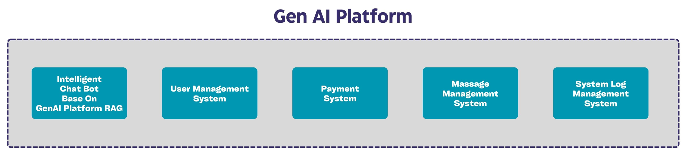

# GenAI Platform: 基于 RAG 架构的智能聊天机器人后端解决方案

<div align="center">
  
</div>

<div align="center">
  <p>
    <a href="https://github.com/MountainLionAi/GenAI-Platform">
        
    </a>
    <a href="https://github.com/MountainLionAi/GenAI-Platform">
        
    </a>
    <a href="https://opensource.org/licenses/Apache-2.0">
      
    </a>
    <a href="https://github.com/MountainLionAi/GenAI-Platform/releases">
      
    </a>
    <a href="https://github.com/MountainLionAi/GenAI-Platform/issues">
      
    </a>
  </p>
  <p>
      <a href="https://codespaces.new/MountainLionAi/GenAI-Platform">
      
    </a>
  </p>

[**English**](README.md)
</div>

## 目录
- [GenAI-Platform 简介](#genai-platform-简介)
- [核心特性](#核心特性)
- [为什么选择 RAG?](#为什么选择-rag)
- [GenAI-Platform RAG](#genai-platform-rag)
- [项目中的子系统](#项目中的子系统)
- [项目安装和运行](#项目安装和运行)
- [API接口介绍](#api接口介绍)
- [项目目录结构](#项目目录结构)
- [技术栈介绍](#技术栈介绍)
- [项目应用场景](#项目应用场景)
- [基于GenAI Platform开发的应用](#基于genai-platform开发的应用)
- [许可证信息](#许可证信息)
- [开发者优势](#开发者优势)
- [联系方式与社区](#联系方式与社区)

## GenAI-Platform 简介

`GenAI Platform` 是一个开源项目，旨在提供一个基于Retrieval-Augmented Generation (RAG) 架构的全面后端解决方案，以便开发者能够构建和部署专门针对垂直细分领域的智能聊天机器人。这个平台通过融合了最新的语言大模型技术，允许开发者无缝整合不同的信息源，并且通过精心设计的调度系统，以及高效的查询转换和路由机制，为用户提供准确和相关的回答。

## 核心特性

- **多元信息源整合**: `GenAI Platform` 支持云端的互联网搜索、数据库存储以及向量存储，使得聊天机器人能够访问和处理来自多个信息源的数据。

- **智能调度器**: 该平台创新开发的调度器使用嵌入模型来处理用户查询，通过函数过滤和匹配有效的信息来源，选择最合适的功能来构建最终的提示，以生成回答。

- **高效的查询处理**: 通过查询转换和路由，`GenAI Platform` 能够将用户查询转化为一个查询列表，然后选择最合适的工具来提供答案。

- **灵活的代理选择**: 平台内置的代理选择机制支持多种查询处理代理，如LlamaIndex和Langchain，为用户查询提供了更多的处理选项。

- **一站式后端服务**: `GenAI Platform` 提供了包括用户管理、支付系统、消息管理以及系统日志管理在内的全面后端支持。

- **良好的扩展性**: 基于模块化设计，易于开发者添加新功能和模块。

- **支持网络异步相应**: 使用sanic网络框架，支持异步请求处理，确保快速响应。

`GenAI-Platform` 是一个基于 RAG（Retrieval Augmented Generation, 检索增强生成）框架的应用程序。RAG通过检索LLMs之外的数据源来支持其生成答案。RAG=搜索+LLM提示，根据用户的查询要求，LLMs会使用搜索算法从外部数据源获取上下文信息，最后，查询和检索到的上下文合成后送入到LLM的提示中。

## 为什么选择 RAG?

### LLM的知识更新难题

- LLM 的训练数据集是固定的，因此一旦训练完成，很难再通过继续训练来更新其知识。
- LLM 参数量庞大，任何时候进行 fine-tuning 都需要消耗大量的资源且耗时。
- 无法直接查询或编辑 LLM 中编码的数百亿参数中的知识。
  
因此,为了让 LLM 拥有持续学习和获取新知识的能力, RAG 应运而生。

### RAG 的工作原理

1. **知识索引**: 对文本数据进行处理,通过词嵌入等技术进行向量化，并存入数据库中，形成可检索的向量索引。
2. **知识检索**: 当有一个输入问题时, RAG 会检索知识库以找到与问题最相关的文档。
3. **生成答案**: RAG 会提供问题和检索到的文档给 LLM，允许 LLM 融合这些外部知识，并生成答案。

这使得 LLM 能够利用外部知识库，无需修改其参数。当知识库更新时，新知识也可以实时注入到 LLM 中。

## GenAI-Platform RAG


在`GenAI Platform RAG`系统中，整个查询处理流程是通过一系列精心设计的组件来协作完成的。以下是流程的主要部分和它们的功能：
#### 调度器 (Dispatcher)

- 嵌入模型 (Embedding Model): 利用嵌入模型处理查询，将查询和聊天历史转换为向量形式，以便于后续的检索和匹配。

- 功能过滤 (Function Filter): 这个部分通过向量数据库对可能的GPT函数进行过滤，有效地解决了GPT函数数量可能的限制问题。

- 功能选择（Function Choice）
在功能选择阶段，系统利用了GPT的function call能力，这允许与语言模型交互，以确定用户查询的上下文和意图。通过这种交互，系统决定调用哪个特定的功能。这是一个关键步骤，因为它直接影响了查询如何被理解和处理。选择正确的功能对于后续生成准确和相关的答案至关重要。

#### 信息源 (Information Source)

- 联网搜索工具: 利用云技术，系统可以进行互联网搜索，获取广泛的实时信息，从而为生成的答案提供丰富的数据支持。在这个过程中，可能会用到的工具有Bing、Metaphor、Preplexity等。

- 数据库存储 (DB Storage): 存储结构化数据，为查询提供必要的历史信息和事实数据。

- 向量存储 (Vector Storage): 存储特征向量，这些向量用于快速检索和比对信息，加速查询处理过程。

#### 代理 (Agent)

- 代理选择（Agent Choice）
在确定了要执行的功能后，代理选择步骤开始发挥作用。这一步骤是特别针对那些复杂的问题设计的，这些问题需要更深层次的理解和分析。LlamaIndex中的Agent与语言模型进行交互，以选择正确的工具进行问题处理。这个代理的功能是在系统内部多次与不同的信息源交互，聚合和综合信息，以产生一个更为精准和深入的答案。

通过代理选择和工具的多次交互，系统能够深入分析问题，结合多个数据点，并考虑不同的信息源来优化回答。这确保了即使面对复杂的查询，GenAI Platform也能提供深度和质量兼备的答案，这些答案不仅基于数据的准确性，还体现了对用户查询背后意图的深刻理解。

- 嵌查询转换 (Query Transformation): 将原始查询转换为适合处理的形式，可能包含对查询的重构或扩展。

- 嵌查询路由 (Query Routing): 确定转换后的查询将发送到哪个信息源或工具进行处理。

- 嵌融合检索 (Fusion Retrieval): 结合多个信息源的数据进行查询处理，以提高回答的准确性和相关性。

#### 最终回答生成

- 匹配提示 (Match Prompt): 根据功能选择和信息检索的结果，匹配合适的提示模板。

- 最终提示 (Final Prompt): 结合匹配到的提示和检索到的信息，生成用于语言模型的最终提示。

- 语言大模型 (LLM): 使用最终的提示，通过语言大模型生成用户的查询答案。

### 总结

通过 `GenAI-Platform` 整套的增强检索的流程，确保了答案的生成不仅基于直接查询的数据，还结合了经过智能选择的函数处理和代理工具的输入，从而提供高质量、个性化和准确的答案。

## 项目中的子系统



1.**智能聊天机器人**: 基于OpenAI的GPT模型，这个子系统是`GenAI Platform`的核心，为用户提供智能化的交互式聊天体验。通过`GenAI Platform RAG`系统能够处理大规模和复杂的查询，同时保持快速响应和高准确度。

2.**用户管理系统**: 这个子系统处理与用户账户相关的所有功能。它不仅支持基本的用户注册、登录、注销功能，还提供了验证码和邮箱验证等安全措施。这确保了用户可以安全地访问他们的账户，同时也保护了平台不受未经授权的访问。

3.**消息管理系统**: 消息管理系统允许用户以高效和有序的方式管理他们的通信。用户可以检索历史消息、共享重要信息，甚至删除不再需要的对话。此外，该系统还支持流式处理，确保消息与前端交互的时效性。

4.**支付系统**: 集成支付功能，用户可以查询支付卡信息、订单检查和账户查询。

5.**系统日志管理系统**: 这个子系统负责记录和管理系统日志。对于监控系统运行状况、调试、以及安全审计至关重要。它能够跟踪用户的活动、系统的性能、以及任何可能的异常或安全事件，从而为系统管理员提供了宝贵的信息。

## 项目安装和运行

1. **安装项目**：

```bash
cd GenAI-Platform
pip install -e .
```

2. **加载向量数据库内容**：

```bash
cd GenAI-Platform
python app.py -a
```

3. **运行平台**：

```bash
cd GenAI-Platform
python app.py
```

## API接口介绍

| 类别          | API路由             | 方法    | 功能描述                               |
|--------------|--------------------|--------|--------------------------------------|
| **Chatbot**  | `/mpcbot/sendchat_gpt4` | POST   | GPT-4版本的chatbot交互                     |
| **GPT**      | `api/getMessageList`    | GET    | 获取消息列表                             |
|              | `api/getMsgGroupList`   | GET    | 获取消息组列表                           |
|              | `api/delMsgGroupList`   | POST   | 删除消息组                               |
|              | `api/sendStremChat`     | POST   | 发送流式聊天内容                           |
| **UserRate** | `api/userRate`          | POST   | 用户评价                                 |
|              | `api/delMessages`       | POST   | 根据编码删除消息                           |
|              | `api/shareMessages`     | POST   | 分享消息                                 |
|              | `api/getShareMessages`  | POST   | 获取分享的消息                            |
| **User**     | `api/userLogin`         | POST   | 用户登录                                 |
|              | `api/checkLogin`        | GET    | 检查登录状态                              |
|              | `api/register`          | POST   | 用户注册                                 |
|              | `api/loginOut`          | GET    | 用户登出                                 |
|              | `api/sendVerifyCode`    | POST   | 发送验证码                               |
|              | `api/sendEmailCode`     | POST   | 发送电子邮件验证码                         |
|              | `api/getCaptcha`        | GET    | 获取验证码图像                             |
|              | `api/testVerifyCode`    | POST   | 验证验证码                                |
|              | `api/modifyPassword`    | POST   | 修改密码                                 |
| **Pay**      | `api/pay/cardInfo`      | GET    | 查询支付卡信息                            |
|              | `api/pay/orderCheck`    | GET    | 检查订单                                 |
|              | `api/pay/account`       | GET    | 查询用户账户                              |
|              | `api/pay/callback`      | POST   | 支付成功回调                              |

## 项目目录结构

以下是 `GenAI-Platform` 中 `genaipf` 主要目录结构和它们的功能描述：

- **conf**: 包含项目的各种配置文件，如服务器端口、数据库连接等设置。

- **constant**: 存放项目中使用的常量定义，如错误代码、消息常量等。

- **controller**: 负责处理API请求，与前端的交互，以及返回响应。API接口定义如`sendchat_gpt4`和`userLogin`都在这里定义。

- **dispatcher**: 负责API的调度逻辑，如将特定请求路由到相应的控制器或处理器。

- **exception**: 该目录包含自定义的异常处理逻辑以及自定义异常类的定义。

- **interfaces**: 定义与外部系统或其他项目模块交互的接口。

- **middlewares**: 用于处理API请求和响应的中间件。这些中间件可以执行诸如认证、日志记录等预处理和后处理任务。

- **routers**: 这里定义了所有API的路由，确保每个请求被正确地导向适当的控制器。

- **services**: 包含项目的核心业务逻辑以及与数据库的交互代码。

- **static**: 用于存放项目的静态资源，如CSS、JavaScript文件和图片等。

- **tools**: 该目录提供了各种联网查询信息的工具（现有Bing、Metaphor、Preplexity）。

- **utils**: 该目录提供了各种实用程序和辅助功能，如日期转换、字符串操作等。

## 技术栈介绍

以下是`GenAI-Platform`的主要技术栈及其在项目中的作用：

- **sanic (23.3.0)**: 一个高效、轻量级的Web服务器框架，支持异步请求处理，为项目提供了主要的Web服务。

- **qdrant-client (1.4.0)**: 向量数据库客户端，用于高效地存储和检索向量数据。

- **openai (1.7.1)**: OpenAI的Python客户端，用于调用GPT系列等模型来实现语言智能回复功能。

- **langchain (0.0.314)**: 链接语言模型与项目功能的工具，为项目中的语言处理部分提供支持。

- **llama-index (0.9.30)**: 同为链接语言模型与项目功能的工具，为本项目提供了强大的Agent相关功能。

- **pymysql (1.1.0)**: MySQL数据库的Python客户端，用于数据存储和检索。

- **redis (3.5.3)**: 高性能的键-值存储系统，用于缓存、会话管理等功能。

- **web3 (6.2.0)**: Ethereum区块链的Python客户端，用于实现与区块链的交互。

- **aiohttp (3.8.4)**: 异步HTTP客户端/服务器框架，用于处理异步网络请求。

- **APScheduler (3.10.1)**: 一个任务调度库，用于定时执行任务或定期运行某些代码片段。

其余的库和工具为项目提供了各种辅助功能和增强性能，确保项目的高效、稳定运行。

## 项目应用场景

- **垂直细分领域的聊天机器人**: 对于特定行业或领域，如法律、医疗或客户支持，该平台能够提供深度定制化的解决方案。

- **知识密集型应用**: 在需要处理大量信息并提供知识性回答的场景下，GenAI Platform的RAG架构能够提供强大的支持。

- **多渠道部署**: 支持多种通信渠道的接入，如网页、移动应用或第三方服务平台，为用户提供灵活的接入选项。

## 基于GenAI Platform开发的应用
### MountainLion: Web3行业的个人GenAI助手
  

  `MountainLion`是一个基于`GenAI Platform`开发的智能助手，专注于深度探索Web3行业。作为您的个人助手，MountainLion利用先进的AI分析能力，提供有关区块链、加密货币、去中心化金融(DeFi)和非同质化代币(NFTs)等领域的详尽信息。无论您是Web3领域的初学者还是资深专家，MountainLion都能帮助您保持对行业动态的领先洞察。

  想了解更多关于MountainLion的信息或者体验产品，请访问此[链接](https://www.mlion.ai/#/)。

## 开发者优势

- **开源协作**: 作为一个开源项目，`GenAI Platform` 鼓励开发者社区的协作和贡献，共同推动平台的发展和创新。

- **定制化和扩展性**: 平台设计的模块化允许开发者根据需要轻松添加或修改功能。

- **文档和支持**: 提供全面的文档和社区支持，帮助开发者快速上手和解决开发过程中的问题。

### Contributors Wall
<a href="https://github.com/MountainLionAi/GenAI-Platform/graphs/contributors">
  
</a>

## 许可证信息

此项目使用 `Apache 2.0` 许可证，这意味着您可以自由地使用、修改和分发代码，但需要给出原始代码的适当归属。

## 联系方式与社区

我们非常重视社区的反馈和建议。

- **GitHub社区**: 如有任何疑问、建议或问题，欢迎在GitHub社区中提问或留言。
- **电子邮件**: 如果您需要进一步的支持或有特殊的需求，可以直接发送电子邮件至：[contact@mountainlion.ai](mailto:contact@mountainlion.ai)

我们会尽快回复并为您提供帮助。
